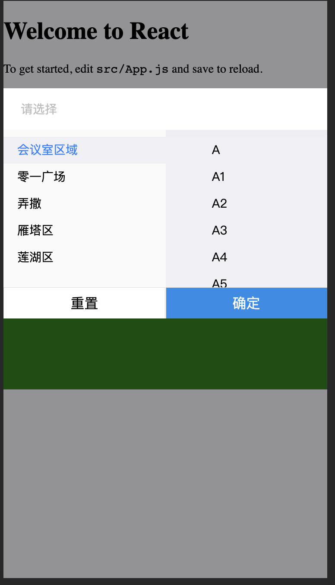

# react-position-select-hm
position select hm

威发微服务位置选择组件定制内容/Wafer microservice position select hm component

[](https://github.com/wafersystems/react-position-select-hm)
[](https://www.npmjs.com/package/react-position-select-hm)
[](https://www.npmjs.com/package/react-position-select-hm)

## 示例图片



## 如何使用

### 安装

`yarn add react-position-select-hm`

### React

```js
import {PositionSelectHM} from 'react-position-select-hm';

<PositionSelectHM {...props}/>

```

属性  | 描述 | 类型 | 默认值
------------- | ------------- | --------------| ------------- 
spaceTree  |   空间数据（[数据](###空间数据)） | array | []
showPositionSelect | 组件是否显示 | bool | false
defaultValue | 默认初始化数据 （[数据](### 默认初始化数据)） | obj | {building:{大楼对象},floor:{楼层对象}}
onClose | 点击关闭X回调 | func | function(){}
onChange | 选择完成后回调 | func | function(data){} , data包含{building:{大楼对象},floor:{楼层对象}}
placeholder | 选择 | string | '请选择'
okButtonText   | 确认按钮文字 | string |  '确定'
cancelButtonText   | 重置按钮文字 | string |  '重置'
buildingName   | 大楼名称key | string |  'name'
buildingId   | 大楼id key | string |  'id'
floorName   | 楼层名称key | string |  'name'
floorId   | 楼层id key | string |  'id'
floorErrorTip   | 重置按钮文字 | string |  '请选择楼层'


defaultValue: PropTypes.array, // 默认值
okButtonText: PropTypes.string, // 确认按钮文字
cancelButtonText: PropTypes.string, // 重置按钮文字
floorErrorTip: PropTypes.string, // 未选择楼层错误提示
buildingName:PropTypes.string, // 大楼名称key
buildingId:PropTypes.string, // 大楼id key
floorName:PropTypes.string, // 楼层名称key
floorId:PropTypes.string, // 楼层id key


### 空间数据

````
export const space3 = [
  {"id": 2, "name": "会议室区域", "parentId": 1, "children": [
      {id:1,name:'A'},
      {id:2,name:'A1'},
      {id:3,name:'A2'},
      {id:4,name:'A3'},
      {id:5,name:'A4'},
      {id:6,name:'A5'},
    ]}, {
    "id": 3,
    "name": "零一广场",
    "parentId": 1,
    "children": [
      {id:1,name:'A'},
      {id:2,name:'A1'},
      {id:3,name:'A2'},
      {id:4,name:'A3'},
      {id:5,name:'A4'},
      {id:6,name:'A5'},
    ]
  }, {"id": 4, "name": "弄撒", "parentId": 1, "children": [
      {id:1,name:'A'},
      {id:2,name:'A1'},
      {id:3,name:'A2'},
      {id:4,name:'A3'},
      {id:5,name:'A4'},
      {id:6,name:'A5'},
    ]}, {
    "id": 5,
    "name": "雁塔区",
    "parentId": 1,
    "children": [
      {id:1,name:'A'},
      {id:2,name:'A1'},
      {id:3,name:'A2'},
      {id:4,name:'A3'},
      {id:5,name:'A4'},
      {id:6,name:'A5'},
    ]
  }, {"id": 6, "name": "莲湖区", "parentId": 1, "children": [
      {id:1,name:'A'},
      {id:2,name:'A1'},
      {id:3,name:'A2'},
      {id:4,name:'A3'},
      {id:5,name:'A4'},
      {id:6,name:'A5'},
    ]}
]

````

### 默认初始化数据

```

 {building:{大楼对象},floor:{楼层对象}}

```

### 开发

````
$ git clone https://github.com/wafersystems/react-position-select-hm.git
$ yarn
$ yarn start

````
